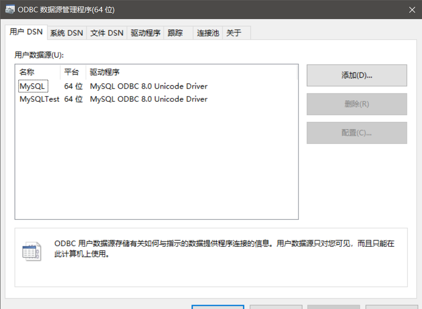

从网络股票行情服务器中提取实时行情和历史行情，将处理后的信息存储于数据库中

#### 功能
1.分别从新浪、腾讯和网易实时行情服务器中提取实时交易数据。

2.分析提取的实时数据其具体交易情况。

3.从网易历史数据服务器中提取日线历史数据。

4.采用MySQL数据库存储提取和分析后的股票行情。

#### 使用方法

###### 系统状态
1.安装MySQL社区版8.0.18.0，设置两个默认用户hxguo和Test，默认密码分别为hxguo和test。

2.在管理工具中添加两个ODBC64位驱动：分别对应hxguo和Test。

